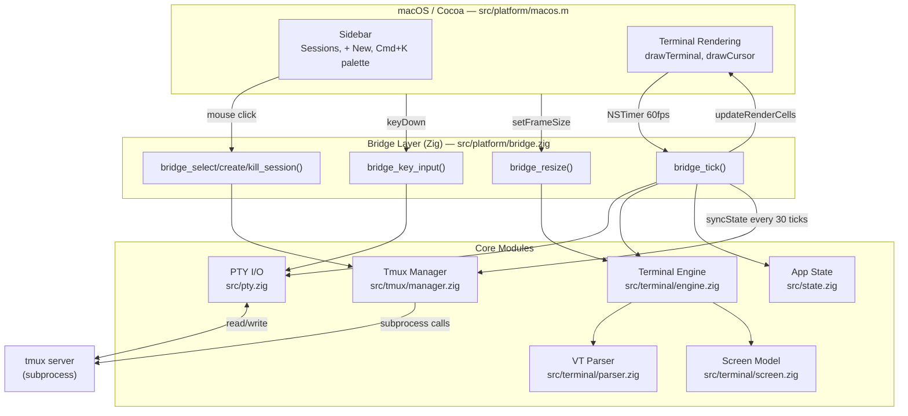
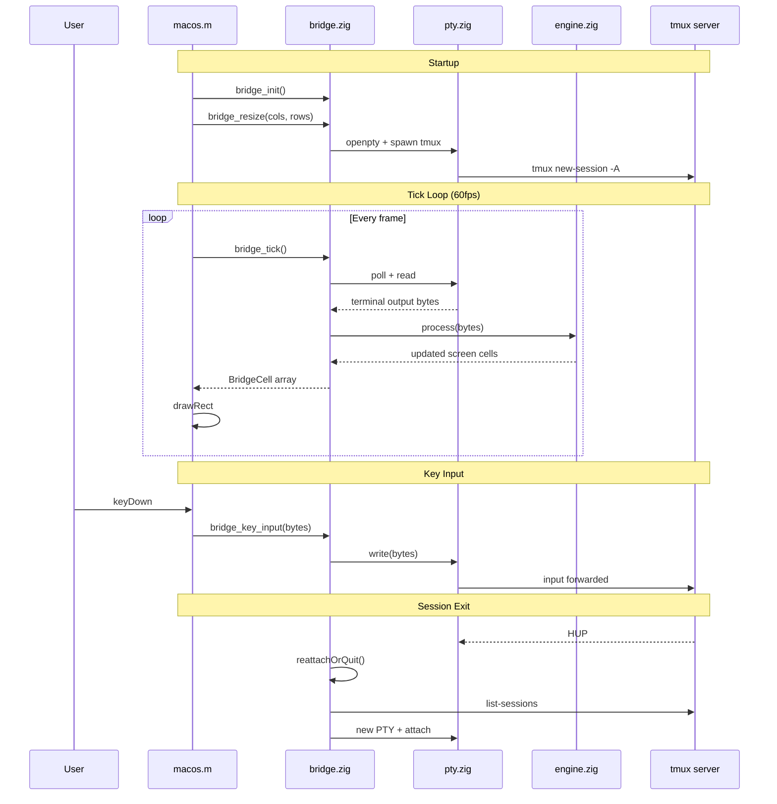

# MultiplexTerm — AGENTS.md

## Project Overview

MultiplexTerm (CLI: `mterm`) is a native macOS GUI terminal that wraps tmux. It provides a modern sidebar UI for session management, a command palette, and full terminal emulation — built for AI-assisted development workflows.

**Stack**: Zig 0.15 + Objective-C/Cocoa (AppKit) + tmux

## Setup & Build

```bash
# Build
zig build

# Run
./zig-out/bin/mterm

# Run tests
zig build test
```

### Requirements
- macOS
- Zig 0.15+
- tmux 3.0+

## Architecture





## File Map

| File | Purpose |
|------|---------|
| `src/main.zig` | Entry point. Imports bridge, calls `platform_run()` |
| `src/platform/macos.m` | ObjC/Cocoa GUI: window, sidebar, terminal rendering, input, command palette |
| `src/platform/bridge.zig` | C FFI bridge: connects GUI ↔ PTY ↔ tmux ↔ terminal engine. All `export fn bridge_*` functions live here |
| `src/pty.zig` | PTY management: `openpty`, `fork`, `exec`, size, read/write |
| `src/terminal/parser.zig` | VT100/ANSI escape sequence parser with UTF-8 support |
| `src/terminal/engine.zig` | Connects parser events to screen model. Handles CSI sequences, DEC private modes, scroll regions |
| `src/terminal/screen.zig` | Screen buffer model: cells, cursor, scroll regions, alt screen, attributes |
| `src/state.zig` | App state: session list, active session, sidebar visibility |
| `src/tmux/manager.zig` | Tmux subprocess commands: list/create/kill/rename sessions, list windows/panes |
| `build.zig` | Build config: compiles Zig + ObjC, links Cocoa framework |

## E2E Data Flow

### Startup
1. `main()` → `platform_run()` (ObjC)
2. ObjC creates NSWindow, STTerminalView, calls `bridge_init()`
3. `bridge_init()` creates TmuxManager, AppState
4. First `setFrameSize` → `recalcTermSize` → `bridge_resize(cols, rows)`
5. `bridge_resize` calls `startPty()` on first invocation (deferred init)
6. `startPty()` creates TerminalEngine, opens PTY, spawns `tmux new-session -A -s <dirname> -e CLAUDECODE=`
7. Hides tmux status bar, enables mouse mode, clears CLAUDECODE from tmux env
8. NSTimer starts at 60fps calling `tick:` → `bridge_tick()`

### Tick Loop (60fps)
1. `bridge_tick()` polls PTY master fd for data
2. Reads PTY output → feeds to `TerminalEngine.process()` → parser → screen model
3. Every 30 ticks (~0.5s): `syncState()` refreshes session list from tmux, updates display names
4. If redraw needed: `updateRenderCells()` copies screen cells to BridgeCell array
5. ObjC `drawRect:` reads BridgeCell array and renders via Core Graphics

### Key Input
1. ObjC `keyDown:` → handles Cmd+K (palette), Cmd+C/V (copy/paste), Option+key (Meta/ESC+char)
2. Arrow keys, special keys → send VT escape sequences
3. Regular keys → `bridge_key_input()` → PTY write
4. Leader key (Ctrl+A) → `handleAppKey()` for session switching (j/k/n/x/b)

### Mouse Input
1. Click in sidebar → `bridge_select_session()`, `bridge_kill_session()`, `bridge_create_session()`
2. Click in terminal → sends xterm mouse protocol (ESC [ M) for tmux pane selection
3. Drag in terminal → text selection (highlighted blue)
4. Scroll wheel → xterm mouse wheel events (tmux mouse mode)

### Session Exit / HUP
1. PTY HUP detected → `reattachOrQuit()`
2. Checks for remaining tmux sessions
3. If sessions exist: opens new PTY, attaches to first available session
4. If no sessions: sets `g_running = false` → app terminates

## Code Style

- Zig: standard library conventions, snake_case for functions/vars
- ObjC: Apple conventions, camelCase methods, `ST` prefix for custom classes
- All bridge functions: `export fn bridge_*` with `callconv(.c)`
- No external dependencies beyond Zig stdlib + macOS system frameworks

## Key Conventions

### Zig ↔ ObjC FFI
- BridgeCell is `extern struct` with explicit padding for C compatibility
- Colors use `u32`: `0xFFFFFFFF` = default, else `0x00RRGGBB`
- Attributes packed in `u8`: bit0=bold, bit1=underline, bit2=reverse, bit3=dim, bit4=italic

### Terminal Emulation
- Parser states: ground, escape, CSI, OSC, DCS, UTF-8, charset
- Engine handles: cursor movement, SGR attributes, scroll regions, alt screen, DEC private modes (1, 7, 25, 1047, 1048, 1049, 2004)
- Screen: deferred line wrap, cursor save/restore, insert/delete line/char

### Display Names
- `computeDisplayName()` in bridge.zig determines sidebar label per session
- Priority: notable app name (via `prettyName()`) → raw command → directory basename → session name
- `isShell()` recognizes: zsh, bash, fish, sh, dash, tcsh, ksh, tmux, login
- `prettyName()` maps: nvim→"NVim", claude→"Claude Code", python3→"Python", node→"Node.js", etc.

### Theme
- Vercel dark: bg=#0A0A0A, sidebar=#111111, border=#2A2A2A, text=#EDEDED
- Fonts: SF Mono (terminal), SF Pro (UI), Menlo (italic/bold-italic)

## Testing

```bash
# Unit tests
zig build test

# Manual testing checklist
# - Launch mterm, verify sidebar shows sessions
# - Open nvim → sidebar should show "NVim"
# - Cmd+K → command palette opens, split pane works
# - Click tmux pane → pane gets focus
# - Type exit → app reattaches to remaining session (not crash)
# - Option+F → forward word (not crash)
# - Double-click terminal → selects line
# - Cmd+C/V → copy/paste works

# Logs
cat /tmp/mterm.log
```

## Common Pitfalls

- **ESC byte ordering**: In parser.zig, `byte == 0x1b` MUST be checked before `byte < 0x20` or all escape sequences break
- **PTY HUP on session kill**: Must switch to another session BEFORE killing, or tmux client exits and PTY gets HUP
- **Deferred PTY init**: PTY is spawned on first `bridge_resize`, not at init — avoids blank lines from size mismatch
- **tmux env inheritance**: CLAUDECODE env var must be cleared at both PTY child level (`unsetenv`) and tmux level (`-e CLAUDECODE=`, `set-environment -g -u`)
- **Display name early returns**: `syncState()` must always call `updateDisplayNames()` — don't return early before it
- **Cells bounds**: `drawTerminal` must bounds-check cell index against `bridge_get_cell_count()` to prevent crashes during resize
- **Option key**: Option+key sends ESC+char (Meta), not the macOS Unicode glyph — terminal apps expect Meta behavior
