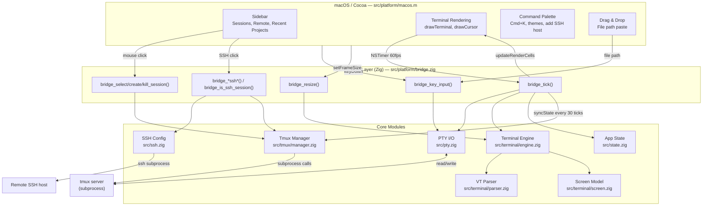
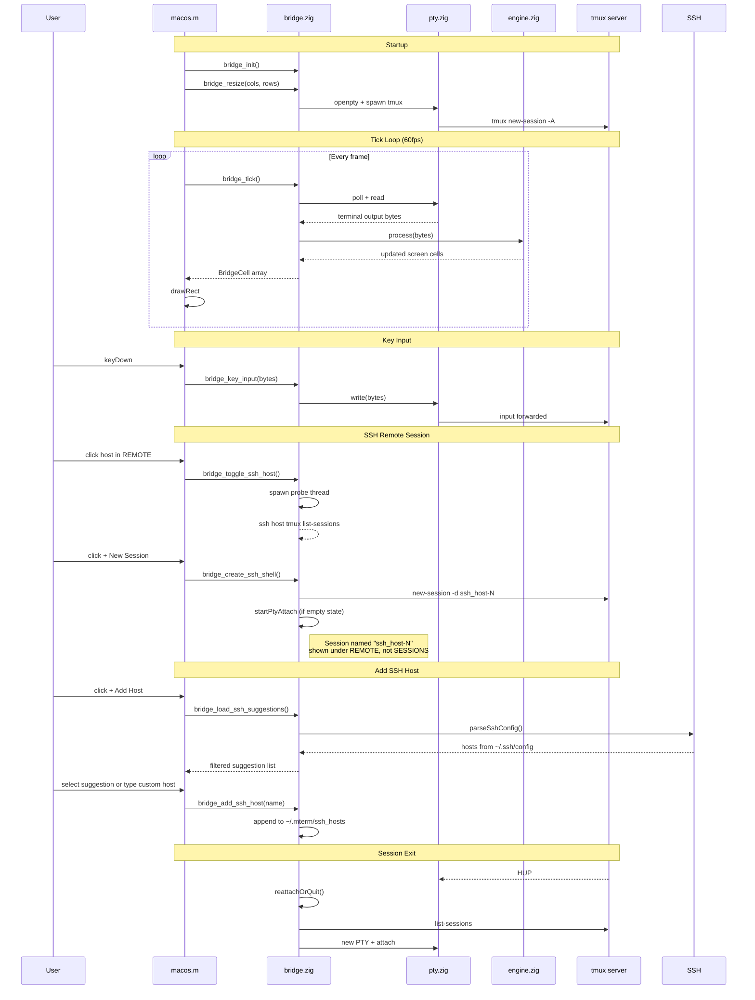

# MultiplexTerm — AGENTS.md

## Project Overview

MultiplexTerm (CLI: `mterm`) is a native macOS GUI terminal that wraps tmux. It provides a modern sidebar UI for session management, a command palette, and full terminal emulation — built for AI-assisted development workflows.

**Stack**: Zig 0.15 + Objective-C/Cocoa (AppKit) + tmux

## Agent Rules

1. **Always update this file** when adding new functionality — document new files, data flows, conventions, and pitfalls.
2. **Always add unit tests** for every new feature and bug fix — no exceptions. Test the specific behavior that was added or fixed (e.g., new struct fields, parsing edge cases, return value semantics). Run `zig build test` to verify before committing.
3. **Update README.md** when adding user-facing features (new shortcuts, UI changes, etc.).
4. **Run `zig build`** to verify compilation before committing.
5. **Run `zig build lint`** to check for lint issues before committing.
6. **Local + Remote parity**: Every new feature or functionality must work in both local sessions and SSH remote sessions. If a feature targets the local tmux (e.g., split pane, new window, mouse clicks), it must also be forwarded to the remote tmux when the active session is SSH. Never add a feature that only works locally — always consider the `ssh_` session path.

## Setup & Build

```bash
# Build
zig build

# Run
./zig-out/bin/mterm

# Install as macOS .app bundle to /Applications
zig build install-app

# Run tests
zig build test

# Lint (requires zlint: https://github.com/DonIsaac/zlint)
zig build lint
```

### Requirements
- macOS
- Zig 0.15+
- tmux 3.0+

## Architecture





## File Map

| File | Purpose |
|------|---------|
| `src/main.zig` | Entry point. Imports bridge, calls `platform_run()` |
| `src/platform/macos.m` | ObjC/Cocoa GUI: window, sidebar, terminal rendering, input, command palette |
| `src/platform/bridge.zig` | C FFI bridge: connects GUI ↔ PTY ↔ tmux ↔ terminal engine. All `export fn bridge_*` functions live here |
| `src/pty.zig` | PTY management: `openpty`, `fork`, `exec`, size, read/write |
| `src/terminal/parser.zig` | VT100/ANSI escape sequence parser with UTF-8 support |
| `src/terminal/engine.zig` | Connects parser events to screen model. Handles CSI sequences, DEC private modes, scroll regions |
| `src/terminal/screen.zig` | Screen buffer model: cells, cursor, scroll regions, alt screen, attributes |
| `src/state.zig` | App state: session list, active session, sidebar visibility |
| `src/tmux/manager.zig` | Tmux subprocess commands: list/create/kill/rename sessions, list windows/panes, create SSH sessions |
| `src/ssh.zig` | SSH config parser (`~/.ssh/config`) and remote tmux session discovery via SSH subprocess |
| `build.zig` | Build config: compiles Zig + ObjC, links Cocoa framework |
| `SSH_INTERNALS.md` | Detailed SSH remote session implementation (probe, lifecycle, mouse/command forwarding) |
| `SIDEBAR.md` | Sidebar layout, hit-testing, hover tracking, text truncation |

## E2E Data Flow

### Startup
1. `main()` → `platform_run()` (ObjC)
2. ObjC creates NSWindow, STTerminalView, calls `bridge_init()`
3. `bridge_init()` creates TmuxManager, AppState
4. First `setFrameSize` → `recalcTermSize` → `bridge_resize(cols, rows)`
5. `bridge_resize` checks for existing tmux sessions on first invocation (deferred init)
6. If existing sessions found: `startPtyAttach()` attaches to first session
7. If no existing sessions: stays in empty state, shows "Start New Session" button
8. Hides tmux status bar, enables mouse mode, clears CLAUDECODE from tmux env
9. NSTimer starts at 60fps calling `tick:` → `bridge_tick()`

### Tick Loop (60fps)
1. `bridge_tick()` polls PTY master fd for data
2. Reads PTY output → feeds to `TerminalEngine.process()` → parser → screen model
3. Every 30 ticks (~0.5s): `syncState()` refreshes session list from tmux, updates display names
4. If redraw needed: `updateRenderCells()` copies screen cells to BridgeCell array
5. ObjC `drawRect:` reads BridgeCell array and renders via Core Graphics

### Key Input
1. ObjC `keyDown:` → handles Cmd+K (palette), Cmd+C/V (copy/paste), Option+key (Meta/ESC+char)
2. Arrow keys, special keys → send VT escape sequences
3. Regular keys → `bridge_key_input()` → PTY write
4. Leader key (Ctrl+A) → `handleAppKey()` for session switching (j/k/n/x/b)

### Mouse Input
1. Click in sidebar → `bridge_select_session()`, `bridge_kill_session()`, `bridge_create_session()`
2. Click in terminal → sends xterm mouse protocol (ESC [ M) for tmux pane selection
3. Drag in terminal → text selection (highlighted blue)
4. Scroll wheel → xterm mouse wheel events (tmux mouse mode)

### SSH Remote Sessions

> **Deep dive**: See [SSH_INTERNALS.md](SSH_INTERNALS.md) for detailed implementation notes (probe mechanics, session lifecycle, kill flows, FFI function table).

1. Sidebar shows "REMOTE" section (between New Session button and Recent Projects) — always visible
2. **Hosts loaded exclusively from `~/.mterm/ssh_hosts`** (mterm's own file, one hostname per line). `~/.ssh/config` is never auto-loaded or modified.
3. Click disconnected host → spawns background thread running `ssh -o BatchMode=yes host tmux list-sessions`
4. If successful, host status = connected, expanded view shows: active SSH sessions → remote tmux sessions → "+ New Session"
5. Click remote tmux session → `tmux.createSshSession()` creates local tmux session running `ssh host -t 'tmux attach-session -t session'`
6. Click "+ New Session" → `bridge_create_ssh_shell()` creates local tmux session running `ssh host` (plain shell)
7. **SSH sessions show under REMOTE, not SESSIONS**: all SSH-created sessions use `ssh_` name prefix (e.g., `ssh_host/session`, `ssh_host-N`), filtered from SESSIONS list via `bridge_is_ssh_session()`, displayed under their host in REMOTE via `bridge_get_ssh_active_count/display/idx()`
8. Active SSH sessions show with green dot + accent bar when selected; remote tmux sessions show dimmer (not yet connected)
9. "+ Add Host" button opens in-app palette card (`paletteMode=2`) showing hosts from `~/.ssh/config` as suggestions (filterable by search), plus custom host entry
10. **× button on any host** removes it from `~/.mterm/ssh_hosts` and kills active SSH sessions for that host
11. Status dots: green=connected, yellow=connecting, red=error, hollow=disconnected
12. **SSH from empty state**: Creating an SSH session when no sessions exist uses `startPtyAttach()` to attach directly to the SSH session — does NOT create an unwanted local session via `startPty()`
13. Backend: `loadSshHosts()` reads `~/.mterm/ssh_hosts`, `saveSshHosts()` writes all hosts. `loadSshSuggestions()` parses `~/.ssh/config` and filters out already-added hosts.
14. FFI: `bridge_load_ssh_suggestions()`, `bridge_get_ssh_suggestion_count/name/name_len()` expose suggestions to ObjC for the Add Host palette

### Agent Attention Notifications
1. Two detection methods (both active, whichever fires first):
   - **BEL/OSC 9**: Agent sends BEL (0x07) or OSC 9 (`ESC ] 9 ; message BEL`) — instant detection
   - **Idle timeout**: No PTY output for ~3 seconds (`IDLE_ATTENTION_TICKS = 180` at 60fps) on an agent session — fallback for agents that don't send BEL
2. `TerminalEngine` captures `bell_fired` and `osc9_message` on each `process()` call
3. In `bridge_tick()`, after processing PTY output, if `bell_fired` is set and the active session is an agent session (`isAgentSession()`), attention state is set for that session
4. OSC 9 payload is used as the attention message; if only BEL or idle timeout, defaults to "Waiting for input..."
5. **Auto-clear on output**: When new PTY output arrives for a session with attention, the attention is cleared (agent is working again)
6. Sidebar shows attention subtitle below session name in accent color (both SESSIONS and REMOTE active sessions)
7. Native macOS notification sent via `UNUserNotificationCenter` when app is not active (one per attention event, tracked by `g_notification_sent[]`)
8. Attention cleared on any user key input (`bridge_key_input()`) or session selection (`bridge_select_session()`)
9. `isAgentSession(idx)` checks: known agent command names, version-string display names, "Claude Code" display name
10. FFI: `bridge_session_needs_attention(idx)`, `bridge_get_attention_message/len(idx)`, `bridge_get_pending_notification(idx_out)`

### Session Exit / HUP
1. PTY HUP detected → `reattachOrQuit()`
2. Checks for remaining tmux sessions
3. If sessions exist: opens new PTY, attaches to first available session
4. If no sessions: sets `g_started = false` → returns to empty state with "Start New Session" button

## Code Style

- Zig: standard library conventions, snake_case for functions/vars
- ObjC: Apple conventions, camelCase methods, `ST` prefix for custom classes
- All bridge functions: `export fn bridge_*` with `callconv(.c)`
- No external dependencies beyond Zig stdlib + macOS system frameworks

## Key Conventions

### Zig ↔ ObjC FFI
- BridgeCell is `extern struct` with explicit padding for C compatibility
- Colors use `u32`: `0xFFFFFFFF` = default, else `0x00RRGGBB`
- Attributes packed in `u8`: bit0=bold, bit1=underline, bit2=reverse, bit3=dim, bit4=italic

### Terminal Emulation
- Parser states: ground, escape, CSI, OSC, DCS, UTF-8, charset
- Engine handles: cursor movement, SGR attributes, scroll regions, alt screen, DEC private modes (1, 7, 25, 1047, 1048, 1049, 2004)
- Screen: deferred line wrap, cursor save/restore, insert/delete line/char

### Display Names
- `computeDisplayName()` in bridge.zig determines sidebar label per session
- Priority: **user-renamed session name** (if not auto-generated) → notable app name (via `prettyName()`) → raw command → directory basename → session name
- `isAutoNameWithPath()` detects auto-generated names: bare digits, `session-N`, `mterm`, `<cwd>-N`, `<session_path>-N`, `<HOME>-N` — anything else is treated as user-renamed
- `isShell()` recognizes: zsh, bash, fish, sh, dash, tcsh, ksh, tmux, login
- `isVersionString()` detects version-like commands (e.g. "2.1.74") that some tools set as process title — maps to "Claude Code"
- Sessions are sorted by `session_created` timestamp (newest first, newest at top)
- `prettyName()` maps: nvim→"NVim", claude→"Claude Code", python3→"Python", node→"Node.js", etc.

### Recent Projects
- Sidebar shows a "RECENT PROJECTS" section below the "+ New Session" button
- Tracks directories from active tmux sessions via `pane_current_path`
- Persisted to `~/.mterm/recent_projects` (one path per line, max 10 entries)
- Clicking a recent project creates a new tmux session in that directory and switches to it
- × button on hover removes a project from the list
- Section always visible with "Nothing yet" placeholder when empty
- Also shown in empty state (no sessions) below the "Start New Session" button
- Backend: `loadRecentProjects()`, `saveRecentProjects()`, `addRecentProject()` in bridge.zig
- FFI: `bridge_get_recent_project_count/display/path()`, `bridge_create_session_in_dir()`, `bridge_remove_recent_project()`
- Manager: `createSessionInDir()` in tmux/manager.zig uses `tmux new-session -d -s <name> -c <dir>`

### Theme System
- 25 built-in themes selectable via Cmd+K → Theme... submenu
- Themes: Vercel Dark (default), Gruvbox Dark/Light, Catppuccin Mocha/Latte, Kanagawa/Light, Nord, Dracula, One Dark/Light, Solarized Dark/Light, Tokyo Night/Light, Rosé Pine/Dawn, Everforest Dark/Light, Monokai Pro, Ayu Dark/Light, Nightfox, Synthwave '84, GitHub Dark
- `ThemeDef` struct: name, bg, fg, sidebar, border, accent, green (all `uint32_t` hex)
- `applyTheme(idx)` computes derived colors (textDim, textMuted, selectedBg, hoverBg) via `blendHex()`
- `g_currentTheme` tracks active theme index; `g_savedTheme` saves the pre-preview theme for revert
- **Live preview**: navigating themes (keyboard or mouse hover) calls `applyTheme()` immediately; Escape/Back reverts to `g_savedTheme`
- `paletteMode`: 0=commands, 1=themes, 2=add SSH host — controls which view `drawPalette` renders
- Both command and theme palette modes have a search bar for filtering items by name (case-insensitive substring match)
- `paletteSearchText` (NSMutableString) holds the current search query; cleared on mode switch, open/close
- `paletteSelection` is always an index into the *filtered* list, not the absolute list; mapped back via `getFilteredCommandIndices:`/`getFilteredThemeIndices:`
- In theme mode, backspace deletes search text; when search is empty, backspace goes back to commands
- Fonts: SF Mono (terminal), SF Pro (UI), Menlo (italic/bold-italic)

### Command Palette (Cmd+K)
- Floating card over terminal — no full-screen overlay (dark overlays make dark themes invisible)
- Card uses drop shadow (`NSShadow`) for contrast against terminal content
- All palette colors use theme globals (`g_sidebarBg`, `g_border`, `g_selectedBg`, `g_text`, etc.) — never hardcoded hex
- Three modes: commands (`paletteMode=0`, 9 items), theme picker (`paletteMode=1`, 25 scrollable items), add SSH host (`paletteMode=2`, suggestion list + text input)
- Commands mode: up/down navigate, Enter executes (or enters theme submenu for last item), Escape closes
- Theme mode: up/down navigate with live preview, Enter confirms, Escape/Backspace reverts and goes back
- Add SSH host mode: shows `~/.ssh/config` hosts as suggestions (filtered by `getFilteredSshSuggestionIndices:`), up/down to select, Enter adds selected suggestion or typed text, Escape cancels — no NSAlert
- Mouse: click to select, hover to highlight (and preview in theme mode), scroll wheel in theme picker
- Cmd+K while in theme preview reverts to saved theme before closing

### Drag and Drop
- Dragging files from Finder into the terminal pastes their file paths (shell-escaped)
- Multiple files are space-separated
- Implemented via `NSDraggingDestination` protocol on STTerminalView
- Registered for `NSPasteboardTypeFileURL` in `initWithFrame`
- Special characters (spaces, quotes, parens) are escaped for shell safety

## Releasing

When publishing a new version, **all steps are required**:

```bash
# 1. Bump version in build.zig (CFBundleVersion + CFBundleShortVersionString)
#    Check existing tags first: git tag --list --sort=-v:refname | head -5

# 2. Commit, tag, and push
git add build.zig
git commit -m "Bump version to X.Y.Z"
git tag vX.Y.Z
git push && git push origin vX.Y.Z

# 3. Create GitHub release
gh release create vX.Y.Z --title "vX.Y.Z" --notes "release notes here"

# 4. Build .app, zip, and upload to release
zig build install-app
cd /tmp && rm -f mTerm.zip
ditto -c -k --sequesterRsrc --keepParent /Applications/mTerm.app mTerm.zip
gh release upload vX.Y.Z /tmp/mTerm.zip

# 5. Update Homebrew tap (https://github.com/Cypressxyx/homebrew-multiplexterm)
shasum -a 256 /tmp/mTerm.zip   # get the SHA
# Clone tap, update Casks/multiplexterm.rb with new version + sha256, commit, push
```

**Checklist:**
- [ ] Version bumped in `build.zig`
- [ ] Git tag matches version
- [ ] GitHub release created with release notes
- [ ] `mTerm.zip` uploaded to the release
- [ ] Homebrew tap `Casks/multiplexterm.rb` updated with new version and SHA256

## Testing

```bash
# Unit tests
zig build test

# Manual testing checklist
# - Launch mterm, verify sidebar shows sessions
# - Open nvim → sidebar should show "NVim"
# - Cmd+K → command palette opens, split pane works
# - Click tmux pane → pane gets focus
# - Type exit → app reattaches to remaining session (not crash)
# - Option+F → forward word (not crash)
# - Double-click terminal → selects line
# - Cmd+C/V → copy/paste works
# - Cmd+K → Theme... → theme picker opens, can select theme with click or keyboard
# - Scroll, hover, and back button work in theme picker
# - Recent projects section appears in sidebar after visiting directories
# - Clicking a recent project creates a new session in that directory
# - Running Claude Code → sidebar should show "Claude Code", not a version number
# - SSH: REMOTE section shows hosts from ~/.mterm/ssh_hosts
# - SSH: Click host → status changes to connecting, then shows remote tmux sessions
# - SSH: Click remote session → creates local tmux session with SSH attach, appears under REMOTE
# - SSH: Click "+ Add Host" → opens palette with ~/.ssh/config suggestions, can filter and select or type custom
# - SSH: × button on host removes it and kills active sessions for that host
# - SSH: Creating remote session from empty state should NOT create extra local session
# - Drag a file from Finder into terminal → file path is pasted (shell-escaped)
# - Drag multiple files → all paths pasted space-separated
# - Agent attention: Run Claude Code, when it asks for input → sidebar shows "Waiting for input..." subtitle
# - Agent attention: Switch away from app → macOS notification sent
# - Agent attention: Type any key → subtitle clears

# Logs
cat /tmp/mterm.log
```

## Common Pitfalls

- **ESC byte ordering**: In parser.zig, `byte == 0x1b` MUST be checked before `byte < 0x20` or all escape sequences break
- **PTY HUP on session kill**: Must switch to another session BEFORE killing, or tmux client exits and PTY gets HUP
- **Deferred PTY init**: On first `bridge_resize`, checks for existing tmux sessions — attaches if found, shows empty state if not. PTY only starts when sessions exist or user clicks "Start New Session"
- **tmux env inheritance**: CLAUDECODE env var must be cleared at both PTY child level (`unsetenv`) and tmux level (`-e CLAUDECODE=`, `set-environment -g -u`)
- **Display name early returns**: `syncState()` must always call `updateDisplayNames()` — don't return early before it
- **Cells bounds**: `drawTerminal` must bounds-check cell index against `bridge_get_cell_count()` to prevent crashes during resize
- **Option key**: Option+key sends ESC+char (Meta), not the macOS Unicode glyph — terminal apps expect Meta behavior
- **Palette overlay**: Do NOT use a full-screen semi-transparent overlay behind the command palette — on dark themes it makes the terminal content invisible. Use a drop shadow on the card instead.
- **Palette colors**: All palette UI colors must use theme globals (`g_sidebarBg`, `g_border`, etc.), never hardcoded hex — otherwise the palette becomes invisible on certain themes
- **Theme preview revert**: When entering theme picker, save `g_currentTheme` to `g_savedTheme`. ALL exit paths (Escape, Backspace, Back click, click outside, Cmd+K toggle) must call `applyTheme(g_savedTheme)` to revert. Only Enter/click-on-theme confirms without revert.
- **Finder/Raycast launch PATH**: macOS GUI apps get a minimal PATH (`/usr/bin:/bin`). Homebrew paths (`/opt/homebrew/bin`, `/usr/local/bin`) must be added at startup in `applicationDidFinishLaunching` or tmux won't be found.
- **Finder/Raycast launch cwd**: When launched from Finder/Raycast, cwd is `/`. `basename("/")` is empty, which gives tmux an invalid session name. ALL code that derives names from cwd (`startPty`, `bridge_create_session`) must fall back to HOME basename or "mterm".
- **Finder/Raycast launch locale**: Without `LANG`/`LC_ALL` set, tmux uses VT100 line-drawing escape sequences instead of UTF-8 box-drawing characters, causing garbled rendering. Must set `LANG=en_US.UTF-8` at startup.
- **Sidebar layout consistency**: `drawSidebar`, `mouseDown:`, `mouseMoved:`, and `rightMouseDown:` must all compute the same flow layout: sessions (skip SSH) → "+ New Session" button → SSH remote section (active SSH sessions → remote tmux sessions → "+ New Session" per host → "+ Add Host") → recent projects. Never bottom-anchor the button. See [SIDEBAR.md](SIDEBAR.md) for full layout details, constants, and hover encoding.
- **SSH probe thread safety**: The SSH connection probe runs in a background thread (`sshProbeThreadFn`). It writes to `g_ssh_hosts[idx]` fields and sets `status = .connected` LAST so the main thread sees consistent state. Uses `std.heap.page_allocator` (thread-safe) for the subprocess.
- **SSH session naming**: All SSH sessions use `ssh_` prefix (e.g., `ssh_host/session`, `ssh_host-3`). `bridge_is_ssh_session()` checks this prefix. `isSshSessionForHost()` matches sessions to hosts by checking `ssh_<hostname>/` or `ssh_<hostname>-`. These sessions are hidden from SESSIONS and shown under REMOTE.
- **SSH session sidebar layout consistency**: `drawSidebar`, `mouseDown:`, `mouseMoved:`, and `rightMouseDown:` must all walk session rows with `bridge_is_ssh_session()` skip — never compute `sessionsEnd = listTop + count * kSessionRowH` since SSH sessions are excluded.
- **No NSAlert for SSH host input**: The "Add Host" prompt MUST use the in-app palette card (`paletteMode=2`), not NSAlert — native macOS dialogs don't match the custom-drawn UI style.
- **SSH host model**: `~/.mterm/ssh_hosts` is the single source of truth for REMOTE hosts. `~/.ssh/config` is only used for suggestions in the Add Host palette (via `loadSshSuggestions()`). Never auto-load or modify `~/.ssh/config`.
- **SSH empty-state attach**: When creating SSH sessions from empty state (`!g_started`), use `startPtyAttach()` — NOT `startPty()`. `startPty()` creates an unwanted local tmux session. The SSH tmux session must be created first (detached via `-d`), then attach to it.
- **SSH host removal cleanup**: `bridge_remove_ssh_host()` must kill all active local SSH sessions for the host (via `isSshSessionForHost()`) before removing the host entry, or sessions become orphaned (hidden from both SESSIONS and REMOTE).
- **SSH probe format string quoting**: The remote command `"tmux list-sessions -F '#{session_name}'"` MUST be a single string arg with the format single-quoted. If `#{session_name}` is unquoted or double-quoted, the remote bash treats `#` as a comment, silently returning 0 sessions.
- **SSH probe resilience on re-probe**: When re-probing an already-connected host, if the probe fails, preserve the existing session list (`session_count` unchanged) instead of wiping to 0. Also, re-probes must NOT set `status = .connecting` — that hides the expanded view.
- **SSH destroy-unattached**: New remote sessions created via `+ New Session` use `tmux new-session \; set-option destroy-unattached on` so the remote session auto-destroys when SSH disconnects (local session killed). Pre-existing attached sessions need explicit `tmux kill-session` via SSH.
- **SSH re-probe after kill**: After killing any SSH session (local or remote), trigger a re-probe of the host to refresh the sidebar. `sshReprobeForSession()` finds the host by matching `ssh_HOST` prefix and spawns the probe thread.
- **SSH remote mouse**: Both `bridge_create_ssh_shell` and `createSshSession` MUST include `set-option mouse on` in the remote tmux command. Without it, the remote tmux never requests mouse tracking (`ESC[?1000h`), so the local tmux consumes mouse clicks instead of forwarding them. Do NOT use `mouse off` on local SSH sessions — that makes local tmux ignore mouse events entirely.
- **SSH palette command forwarding**: `runTmuxCmd()` must detect SSH sessions and forward commands to the remote tmux via `ssh HOST "tmux ..."` instead of running them locally. Otherwise split-pane/new-window/etc. affect the local single-pane SSH session, not the remote tmux.
- **SSH probe session filtering**: `bridge_get_ssh_session_count/name/name_len` must filter out remote sessions that are already attached via local SSH sessions (e.g., hide probe result "8" when `ssh_host/8` exists). `bridge_select_ssh_session` and `bridge_kill_remote_session` must map filtered indices back to raw probe indices via `mapFilteredSshSession()`.
- **Drag-and-drop path escaping**: File paths from Finder drag must be shell-escaped (spaces, quotes, parens) before sending to PTY, or commands will break on paths with special characters.
- **Agent attention detection**: Two methods: (1) BEL/OSC 9 — instant, event-driven; (2) idle timeout (~3s no output) — fallback. Only fires for agent sessions (`isAgentSession()`). Must clear `bell_fired` and `osc9_len` after processing in `bridge_tick()`. Attention auto-clears when new output arrives, or on user input/session switch. `g_idle_ticks` resets on PTY output AND on key input.
- **Notification deduplication**: `g_notification_sent[idx]` prevents repeated macOS notifications for the same attention event. Reset on user input (`bridge_key_input`) alongside `g_attention` and `g_attention_msg_lens`.
