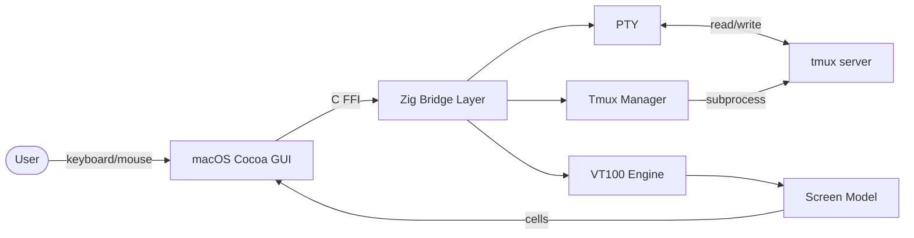

# MultiplexTerm

A native macOS terminal multiplexer GUI built with Zig and Cocoa. Wraps tmux with a modern dark UI for managing sessions, panes, and windows — designed for AI-assisted development workflows.

## Features

- Native macOS GUI with Vercel-style dark theme
- Tmux session management (create, rename, delete, switch)
- Smart session names (auto-detects running apps like NVim, Claude Code, etc.)
- Command palette (Cmd+K) for splits, windows, and pane control
- VT100/ANSI terminal emulation with 256-color and RGB support
- Text selection, copy/paste (Cmd+C/V)
- Mouse support (pane selection, scroll)

## How It Works



## Requirements

- macOS
- [Zig](https://ziglang.org/download/) 0.15+
- [tmux](https://github.com/tmux/tmux) 3.0+

## Build & Run

```bash
# Clone the repo
git clone https://github.com/Cypressxyx/MultiplexTerm.git
cd MultiplexTerm

# Build
zig build

# Run
./zig-out/bin/mterm
```

## Install tmux (if needed)

```bash
# Homebrew
brew install tmux
```

## Keyboard Shortcuts

| Shortcut | Action |
|----------|--------|
| Cmd+K | Command palette (split panes, new window, zoom, etc.) |
| Cmd+C | Copy selection |
| Cmd+V | Paste |
| Cmd+Q | Quit |

## Session Management

- Click a session in the sidebar to switch
- Click **+ New Session** to create one
- Double-click a session to rename
- Click **×** once to arm (turns red), click again to delete
- Right-click a session for context menu
