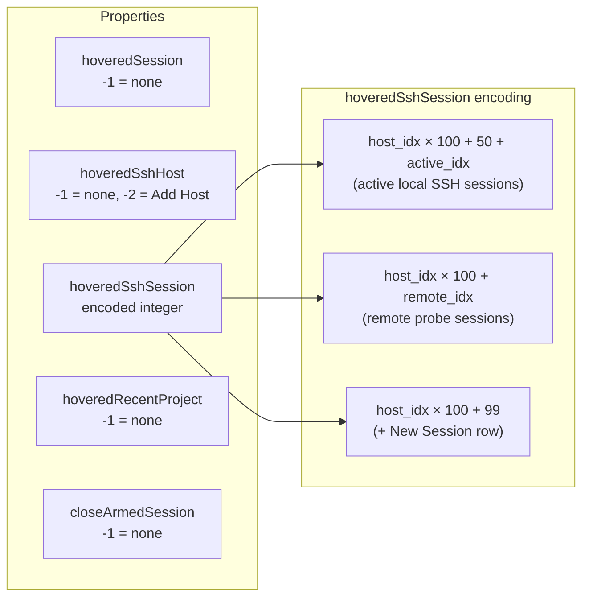
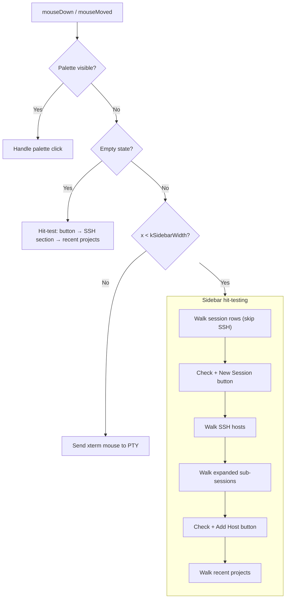

# Sidebar & Empty State — Internals

Detailed implementation notes for the sidebar UI. See [AGENTS.md](AGENTS.md) for the high-level overview.

## Layout Architecture

The sidebar has two rendering paths: `drawSidebar` (normal state) and `drawEmptyState` (no sessions). Both must keep their layout in sync with the mouse hit-testing in `mouseDown:`, `mouseMoved:`, and `rightMouseDown:`.

```mermaid
flowchart TD
    subgraph drawSidebar["drawSidebar (normal state)"]
        S1["SESSIONS header<br/>kHeaderHeight = 48px"]
        S2["Session rows<br/>kSessionRowH = 34px each<br/>⚠️ skip SSH sessions"]
        S3["+ New Session button<br/>kNewBtnHeight = 44px"]
        S4["REMOTE header<br/>kRecentHeaderH = 36px"]
        S5["SSH host rows<br/>kSessionRowH = 34px each"]
        S6["Expanded sessions<br/>kRecentRowH = 30px each<br/>(active SSH + remote probe + New Session)"]
        S7["+ Add Host button<br/>kNewBtnHeight × 0.7 ≈ 31px"]
        S8["RECENT PROJECTS header<br/>kRecentHeaderH = 36px"]
        S9["Project rows<br/>kRecentRowH = 30px each"]

        S1 --> S2 --> S3 --> S4 --> S5 --> S6 --> S7 --> S8 --> S9
    end

    subgraph drawEmptyState["drawEmptyState (no sessions)"]
        E1["Start New Session button<br/>centered, 180×40px"]
        E2["REMOTE section<br/>same structure as sidebar"]
        E3["RECENT PROJECTS section<br/>rpRowH = 32px each"]

        E1 --> E2 --> E3
    end
```



## Constants

```
kSidebarWidth     = 220px     // Total sidebar width
kSidebarPadH      = 16px      // Horizontal padding from left edge
kSessionRowH      = 34px      // Session and host row height
kRecentRowH       = 30px      // Sub-session and project row height
kRecentHeaderH    = 36px      // Section header height
kHeaderHeight     = 48px      // Top SESSIONS header + separator
kNewBtnHeight     = 44px      // "+ New Session" / "+ Add Host" button height
kAccentBarW       = 3px       // Left accent bar for selected row
kTitlebarInset    = 28px      // Space for macOS traffic light buttons
```

## Section Details

### Session Rows

Each session row contains:
- **Green dot** (6px) at `kSidebarPadH` — visible when attached
- **Display name** at `kSidebarPadH + 14` — bold when selected, truncated with ellipsis
- **× close button** at `sw - 28` — visible on hover or selected

Selection: blue background + 3px accent bar on left. Hover: lighter background.

**SSH sessions are skipped** via `bridge_is_ssh_session(i)` — they show under REMOTE instead.

### SSH Host Rows

Each host row contains:
- **Status dot** at `kSidebarPadH`: green=connected, yellow=connecting, red=error, hollow=disconnected
- **Host name** at `kSidebarPadH + 14` — truncated
- **Expand arrow** (▾/▸) or spinner (↻) at `sw - 24`
- **× remove button** at `sw - 28` — visible on hover

### Expanded SSH Sessions (under a host)

Three types of sub-rows, all at `kRecentRowH` height:

1. **Active local SSH sessions** — green dot, display name, × close on hover/selected
2. **Remote probe sessions** — dimmer text, × close on hover (filtered: hides already-attached)
3. **"+ New Session"** row — creates new remote tmux session

## Hover Tracking



Empty-state recent projects use `hoveredRecentProject = rpIdx + 1000` to distinguish from sidebar context (plain `rpIdx`).

## Mouse Hit-Testing Flow



**Critical**: All four methods (`drawSidebar`, `mouseDown:`, `mouseMoved:`, `rightMouseDown:`) must walk the layout in the same order with the same row heights, or click targets will be misaligned with visual elements.

## Close Button Behavior

| Element | Behavior | Visibility |
|---------|----------|-----------|
| Session × | First click arms (turns red), second click kills | Hover or selected |
| SSH host × | Direct remove + kill sessions | Hover only |
| SSH session × | Direct kill (local or remote) | Hover or selected |
| Remote session × | Direct kill via SSH | Hover only |
| Recent project × | Direct remove from list | Hover only |

## Text Truncation

All dynamic sidebar text uses `NSLineBreakByTruncatingTail` via `drawInRect:withAttributes:` to prevent overflow past the sidebar boundary. Max text width = `sw - 28 - textX` (reserves space for × button).

```objc
NSMutableParagraphStyle* truncStyle = [[NSMutableParagraphStyle alloc] init];
truncStyle.lineBreakMode = NSLineBreakByTruncatingTail;
// Add NSParagraphStyleAttributeName: truncStyle to attrs dict
// Use drawInRect: instead of drawAtPoint:
```

## Key Pitfalls

- **Layout sync**: Any change to row heights or section order in `drawSidebar` must be mirrored in `mouseDown:`, `mouseMoved:`, and `rightMouseDown:` — or clicks won't match what's drawn
- **SSH session skip**: The session loop must always call `bridge_is_ssh_session(i)` and `continue` — never assume `sessionsEnd = listTop + count * kSessionRowH`
- **Hover encoding**: SSH session hover uses `host_idx * 100 + offset` encoding — active sessions use offset 50, remote sessions use no offset, "+ New Session" uses 99. Max 50 sessions per host.
- **Theme colors**: All sidebar colors must use theme globals (`g_sidebarBg`, `g_border`, `g_selectedBg`, `g_text`, `g_textDim`, `g_textMuted`, `g_hoverBg`, `g_accent`, `g_green`) — never hardcoded hex
- **Text overflow**: Always use `drawInRect:` with `truncStyle` for user-provided text (names, paths). `drawAtPoint:` is only safe for fixed strings like headers and buttons.
