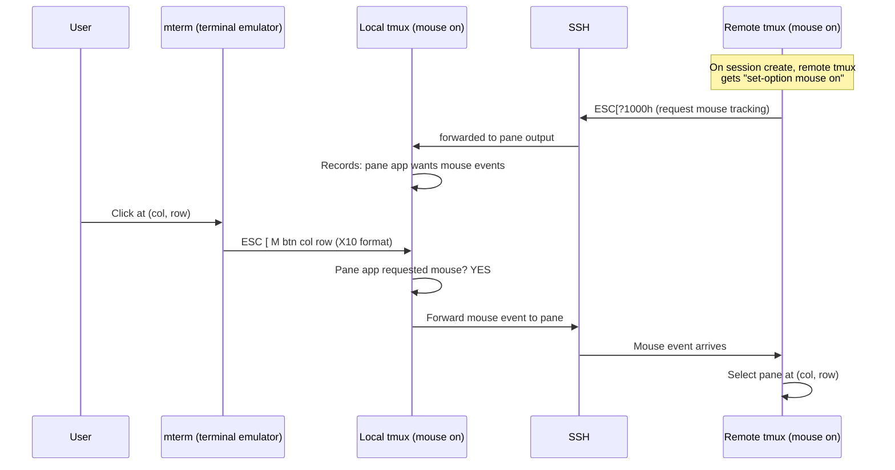
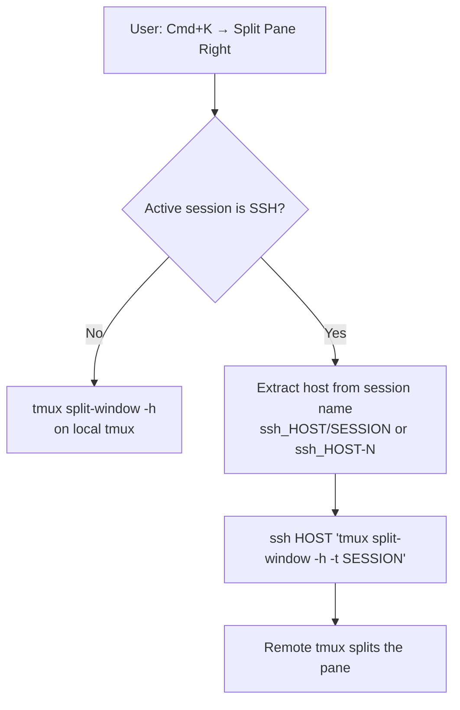

# SSH Remote Sessions — Internals

Detailed implementation notes for the SSH remote session system. See [AGENTS.md](AGENTS.md) for the high-level overview.

## Host Model

`~/.mterm/ssh_hosts` is the **single source of truth** for the REMOTE sidebar. One hostname per line. `~/.ssh/config` is never auto-loaded or modified — it's only parsed for suggestions in the Add Host palette.

- `loadSshHosts()` reads `~/.mterm/ssh_hosts`
- `saveSshHosts()` writes all hosts back
- `loadSshSuggestions()` parses `~/.ssh/config`, filters out already-added hosts
- `bridge_add_ssh_host()` appends to the list + saves
- `bridge_remove_ssh_host()` kills active sessions for the host, removes from list + saves

## SSH Probe

Discovers remote tmux sessions by running:
```
ssh -o ConnectTimeout=5 -o BatchMode=yes -o StrictHostKeyChecking=accept-new HOST "tmux list-sessions -F '#{session_name}'"
```

**Critical**: The format string MUST be single-quoted in the remote command string. SSH concatenates args and passes them to the remote shell. Without quotes, `#` is treated as a bash comment, making `tmux list-sessions -F` fail (no format arg → non-zero exit → 0 sessions returned). This was a real bug that caused all probes to return 0 sessions.

### Probe triggers
- First click on a disconnected host → probe in background thread
- Expanding a collapsed connected host → re-probe
- After `bridge_create_ssh_shell()` → re-probe (without changing status to `.connecting`)
- After `bridge_kill_remote_session()` → re-probe

### Probe resilience
- If a re-probe fails on an already-connected host, the existing session list is preserved (not wiped to 0)
- Re-probes after session creation do NOT set `host.status = .connecting` — this would hide the expanded view while probing
- `g_ssh_probe_thread` guards against concurrent probes

## Session Naming

| Action | Local tmux session name | Remote tmux session |
|--------|------------------------|---------------------|
| `+ New Session` | `ssh_HOST-N` | Auto-named, has `destroy-unattached on` |
| Click remote session | `ssh_HOST/SESSION` | Pre-existing session `SESSION` |

`bridge_is_ssh_session()` checks `ssh_` prefix. `isSshSessionForHost()` matches `ssh_HOST/` or `ssh_HOST-`.

SSH sessions are **hidden from SESSIONS** and shown under their host in **REMOTE**.

## Session Lifecycle

### Creating (+ New Session)
```
local: tmux new-session -d -s ssh_HOST-N ssh HOST -t "tmux new-session \; set-option destroy-unattached on \; set-option mouse on"
```
- `destroy-unattached on` ensures the remote session auto-destroys when SSH disconnects
- From empty state: uses `startPtyAttach()` (NOT `startPty()` which creates an unwanted local session)

### Attaching (click remote session)
```
local: tmux new-session -d -s ssh_HOST/SESSION ssh HOST -t "tmux attach-session -t SESSION \; set-option mouse on"
```

### Killing (× button)

**Active local SSH sessions** (`bridge_kill_session`):
1. If name contains `/` (attached session): SSH to remote, run `tmux kill-session -t SESSION`
2. Kill local tmux session
3. Re-probe the host to refresh sidebar

**Remote unattached sessions** (`bridge_kill_remote_session`):
1. SSH to remote, run `tmux kill-session -t SESSION`
2. Re-probe the host to refresh sidebar

**New sessions** (created via `+ New Session`):
- Have `destroy-unattached on` — remote session auto-destroys when local session is killed (SSH drops)

### Host removal (× on host)
1. Kill all local SSH sessions matching `ssh_HOST/` or `ssh_HOST-`
2. Remove from `~/.mterm/ssh_hosts`
3. Sync state

## Mouse Forwarding

Mouse clicks must reach the **remote** tmux for pane selection, scrolling, etc. The chain is:

```
mterm (X10 mouse) → local tmux → SSH → remote tmux
```



**Critical**: The remote tmux MUST have `mouse on`, otherwise it never sends `ESC[?1000h` to the local tmux pane, and the local tmux consumes mouse clicks for its own (single-pane, no-op) pane selection instead of forwarding. Both `bridge_create_ssh_shell` and `createSshSession` include `set-option mouse on` in the remote tmux command for this reason.

**Why not `mouse off` on local?** Setting `mouse off` on the local SSH session doesn't help — local tmux with `mouse off` ignores mouse escape sequences entirely rather than forwarding them to the pane.

## Command Forwarding (Palette → Remote)

When the active session is an SSH session, Cmd+K palette commands (split pane, new window, etc.) must target the **remote** tmux, not the local one.



`runTmuxCmd()` checks if the active session starts with `ssh_`. If so, calls `runRemoteTmuxCmd()` which:
1. Parses host from session name (`ssh_` prefix, `/` or `-N` suffix)
2. Builds remote tmux command string (with `-t SESSION` when session name is known)
3. Runs via `ssh -o ConnectTimeout=5 HOST "tmux ..."

All 8 palette commands are forwarded: split-h, split-v, new-window, next/prev-window, next-pane, kill-pane, resize/zoom.

## Session Filtering (Probe vs Active)

Probe results show ALL remote tmux sessions, but sessions already attached via local SSH should be hidden to avoid duplicates.

```
Probe returns: [6, 7, 8]
Active local:  [ssh_host/8, ssh_host/6]
Sidebar shows: [ssh_host/8, ssh_host/6, 7]  ← only "7" from probe
```

`isRemoteSessionAttached(host_idx, sess_idx)` checks if any local session matches `ssh_HOST/SESSION`. The `bridge_get_ssh_session_count/name/name_len` functions filter these out, and `bridge_select_ssh_session` / `bridge_kill_remote_session` use `mapFilteredSshSession()` to map filtered indices back to raw probe indices.

## FFI Functions

| Bridge function | Purpose |
|----------------|---------|
| `bridge_toggle_ssh_host(idx)` | Connect (probe) / expand+re-probe / collapse |
| `bridge_select_ssh_session(host, sess)` | Attach to a remote tmux session |
| `bridge_create_ssh_shell(host)` | Create new remote session via SSH |
| `bridge_kill_remote_session(host, sess)` | Kill a remote session via SSH + re-probe |
| `bridge_remove_ssh_host(idx)` | Remove host, kill its sessions |
| `bridge_load_ssh_suggestions()` | Load `~/.ssh/config` hosts for Add Host palette |
| `bridge_get_ssh_suggestion_count/name/name_len()` | Read suggestion list |
| `bridge_get_ssh_host_count/name/name_len/status/expanded()` | Read host list |
| `bridge_get_ssh_session_count/name/name_len()` | Read probe results (filtered — excludes attached) |
| `bridge_get_ssh_active_count/session_idx/display/display_len()` | Read active local SSH sessions |
| `bridge_is_ssh_session(idx)` | Check if session has `ssh_` prefix |
